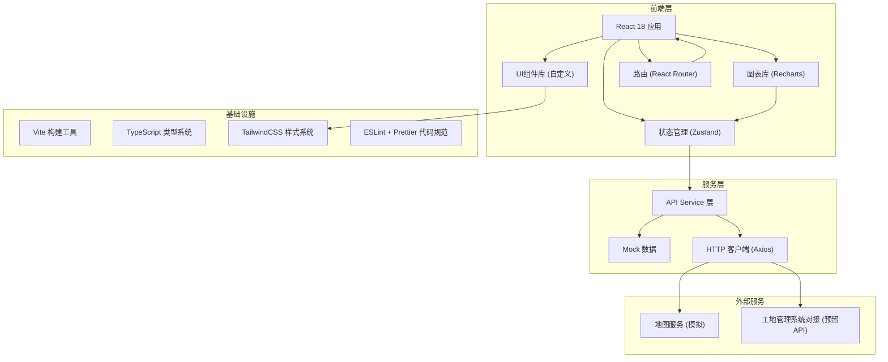
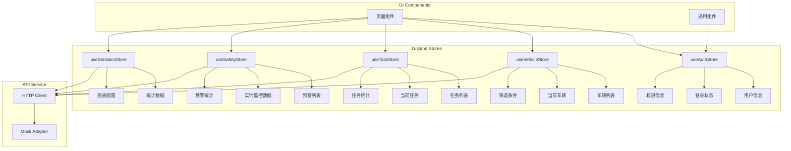
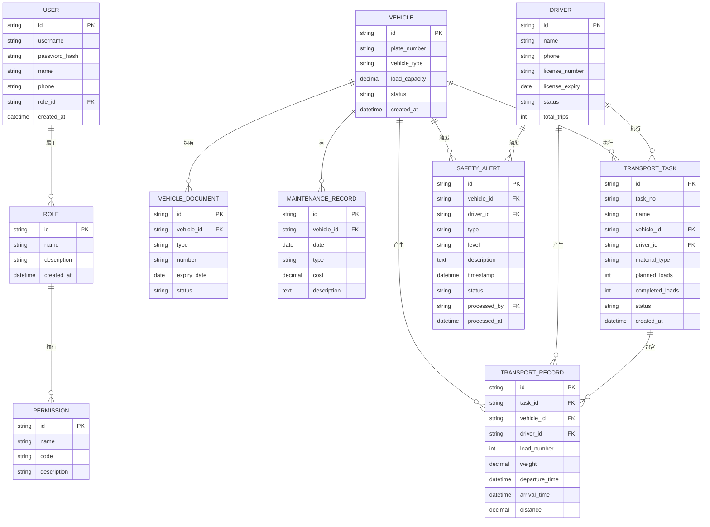

## 1. 架构设计

系统采用前后端分离的架构设计，前端使用React生态构建现代化单页应用，后端采用RESTful API架构。数据层使用Mock数据模拟，便于前端独立开发和演示。



## 2. 技术描述

### 2.1 前端技术栈

| 技术 | 版本 | 用途 |
|------|------|------|
| React | ^18.2.0 | 核心UI框架 |
| TypeScript | ^5.0.0 | 类型安全 |
| Vite | ^5.0.0 | 构建工具和开发服务器 |
| React Router | ^6.20.0 | 路由管理 |
| Zustand | ^4.4.0 | 状态管理 |
| TailwindCSS | ^3.4.0 | CSS框架 |
| Recharts | ^2.10.0 | 数据可视化图表 |
| Axios | ^1.6.0 | HTTP客户端 |
| Lucide React | ^0.294.0 | 图标库 |

### 2.2 项目初始化

使用Vite官方模板初始化React+TypeScript项目：
```bash
npm create vite@latest slag-truck-management -- --template react-ts
```

### 2.3 后端与数据

- **后端**：前端独立开发，使用Mock数据模拟后端API
- **数据持久化**：使用localStorage存储用户偏好和临时数据
- **数据对接**：预留RESTful API接口，便于后续与真实后端及工地管理系统对接

### 2.4 目录结构

```
src/
├── components/          # 通用组件
│   ├── Layout/         # 布局组件
│   ├── Table/          # 数据表格
│   ├── Form/           # 表单组件
│   ├── Charts/         # 图表组件
│   └── UI/             # 基础UI组件
├── pages/              # 页面组件
│   ├── Dashboard/      # 仪表盘
│   ├── Vehicles/       # 车辆管理
│   ├── Tasks/          # 任务调度
│   ├── Drivers/        # 驾驶员管理
│   ├── Statistics/     # 运输统计
│   ├── Safety/         # 安全监控
│   └── System/         # 系统管理
├── store/              # 状态管理
│   ├── useAuthStore.ts
│   ├── useVehicleStore.ts
│   └── useTaskStore.ts
├── services/           # API服务
│   ├── api.ts
│   ├── vehicleService.ts
│   └── mock/           # Mock数据
├── types/              # TypeScript类型定义
├── utils/              # 工具函数
├── hooks/              # 自定义Hooks
├── App.tsx
└── main.tsx
```

## 3. 路由定义

| 路由路径 | 页面名称 | 说明 |
|---------|---------|------|
| `/` | 仪表盘首页 | 数据概览、关键指标、预警提醒 |
| `/vehicles` | 车辆管理列表 | 车辆信息列表、搜索筛选 |
| `/vehicles/new` | 新增车辆 | 车辆信息录入表单 |
| `/vehicles/:id` | 车辆详情 | 车辆详细信息、证件、维护记录 |
| `/vehicles/:id/edit` | 编辑车辆 | 车辆信息编辑 |
| `/tasks` | 任务调度列表 | 运输任务列表、状态管理 |
| `/tasks/new` | 创建任务 | 新建运输任务表单 |
| `/tasks/:id` | 任务详情 | 任务信息、实时跟踪 |
| `/tasks/tracking` | 实时跟踪 | 车辆实时位置监控 |
| `/drivers` | 驾驶员列表 | 驾驶员信息管理 |
| `/drivers/:id` | 驾驶员详情 | 驾驶员档案、绩效统计 |
| `/statistics` | 运输统计 | 运输量数据报表、可视化图表 |
| `/safety` | 安全监控 | 实时监控、预警列表、违规记录 |
| `/system/users` | 用户管理 | 用户账号管理 |
| `/system/permissions` | 权限配置 | 角色权限管理 |
| `/system/backup` | 数据备份 | 备份与恢复操作 |
| `/login` | 登录页 | 用户登录 |

## 4. API 定义（预留接口）

### 4.1 类型定义

```typescript
// 车辆信息
interface Vehicle {
  id: string;
  plateNumber: string;
  vehicleType: string;
  loadCapacity: number;
  manufacturer: string;
  model: string;
  year: number;
  status: 'active' | 'maintenance' | 'inactive' | 'repair';
  documents: VehicleDocument[];
  maintenanceRecords: MaintenanceRecord[];
  currentLocation?: Location;
  createdAt: string;
  updatedAt: string;
}

// 车辆证件
interface VehicleDocument {
  id: string;
  type: string;
  number: string;
  issueDate: string;
  expiryDate: string;
  status: 'valid' | 'expiring' | 'expired';
  imageUrl?: string;
}

// 维护记录
interface MaintenanceRecord {
  id: string;
  date: string;
  type: string;
  description: string;
  cost: number;
  mileage: number;
  operator: string;
}

// 运输任务
interface TransportTask {
  id: string;
  taskNo: string;
  name: string;
  vehicleId: string;
  driverId: string;
  route: Route;
  materialType: string;
  plannedLoads: number;
  completedLoads: number;
  status: 'pending' | 'in_progress' | 'completed' | 'cancelled';
  startTime?: string;
  endTime?: string;
  createdAt: string;
}

// 驾驶员
interface Driver {
  id: string;
  name: string;
  gender: string;
  phone: string;
  idCard: string;
  licenseNumber: string;
  licenseType: string;
  licenseExpiry: string;
  status: 'on_duty' | 'off_duty' | 'rest' | 'violation';
  totalTrips: number;
  totalDistance: number;
  violationCount: number;
}

// 安全预警
interface SafetyAlert {
  id: string;
  vehicleId: string;
  driverId: string;
  type: 'speeding' | 'fatigue' | 'violation';
  level: 'low' | 'medium' | 'high' | 'critical';
  description: string;
  location?: Location;
  speed?: number;
  drivingHours?: number;
  timestamp: string;
  status: 'pending' | 'processed' | 'ignored';
  processedBy?: string;
  processedAt?: string;
  remark?: string;
}

// 运输记录
interface TransportRecord {
  id: string;
  taskId: string;
  vehicleId: string;
  driverId: string;
  loadNumber: number;
  weight: number;
  departureTime: string;
  arrivalTime: string;
  startLocation: Location;
  endLocation: Location;
  distance: number;
}
```

### 4.2 API 接口列表

| 方法 | 路径 | 说明 |
|------|------|------|
| GET | `/api/vehicles` | 获取车辆列表 |
| POST | `/api/vehicles` | 新增车辆 |
| GET | `/api/vehicles/:id` | 获取车辆详情 |
| PUT | `/api/vehicles/:id` | 更新车辆信息 |
| DELETE | `/api/vehicles/:id` | 删除车辆 |
| GET | `/api/tasks` | 获取任务列表 |
| POST | `/api/tasks` | 创建任务 |
| GET | `/api/tasks/:id` | 获取任务详情 |
| PUT | `/api/tasks/:id` | 更新任务 |
| GET | `/api/drivers` | 获取驾驶员列表 |
| GET | `/api/drivers/:id` | 获取驾驶员详情 |
| GET | `/api/statistics/transport` | 获取运输统计数据 |
| GET | `/api/safety/alerts` | 获取安全预警列表 |
| PUT | `/api/safety/alerts/:id/process` | 处理安全预警 |
| GET | `/api/system/users` | 获取用户列表 |
| POST | `/api/auth/login` | 用户登录 |

## 5. 状态管理架构



## 6. 数据模型

### 6.1 ER 图



### 6.2 索引设计

| 表名 | 索引字段 | 索引类型 | 说明 |
|------|---------|---------|------|
| VEHICLE | plate_number | UNIQUE | 车牌号唯一索引 |
| VEHICLE | status | NORMAL | 状态查询优化 |
| TRANSPORT_TASK | status | NORMAL | 任务状态筛选 |
| TRANSPORT_TASK | vehicle_id, created_at | COMPOSITE | 车辆任务历史查询 |
| TRANSPORT_RECORD | task_id | NORMAL | 任务记录查询 |
| TRANSPORT_RECORD | created_at | NORMAL | 时间范围统计 |
| SAFETY_ALERT | status, level | COMPOSITE | 预警筛选优化 |
| SAFETY_ALERT | timestamp | NORMAL | 时间范围查询 |

## 7. 安全设计

### 7.1 认证与授权

- **JWT Token认证**：用户登录后返回Access Token和Refresh Token
- **Token自动刷新**：Token过期前自动刷新
- **RBAC权限控制**：基于角色的访问控制
- **路由守卫**：未登录用户自动跳转登录页
- **操作权限校验**：按钮级别的权限控制

### 7.2 数据安全

- **敏感数据加密**：密码使用bcrypt哈希存储
- **输入验证**：所有用户输入进行XSS和SQL注入防护
- **HTTPS传输**：生产环境强制HTTPS
- **操作日志**：记录所有关键操作便于审计

### 7.3 接口安全

- **请求签名**：重要接口请求签名验证
- **限流机制**：防止接口恶意调用
- **IP白名单**：管理后台可配置IP访问限制

## 8. 性能优化

- **代码分割**：基于路由的代码分割，按需加载
- **组件懒加载**：使用React.lazy和Suspense
- **虚拟列表**：大数据量表格使用虚拟滚动
- **图表优化**：大数据量时开启图表采样
- **请求缓存**：GET请求结果缓存，减少重复请求
- **防抖节流**：搜索输入、滚动事件优化
- **图片懒加载**：图片资源按需加载
